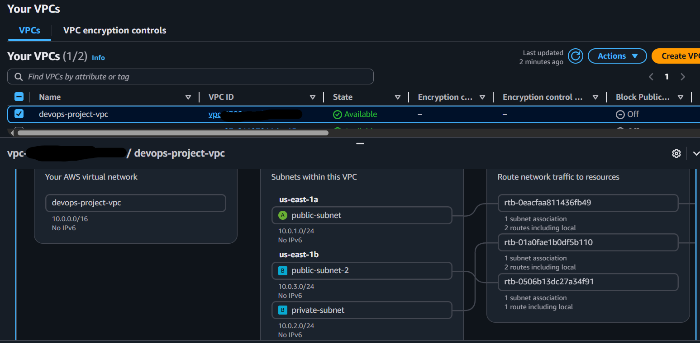
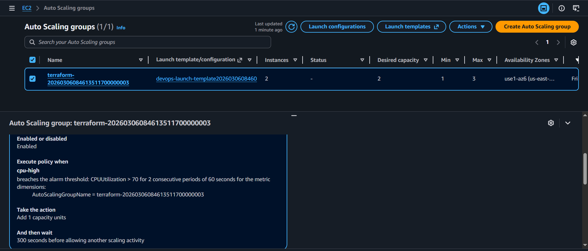
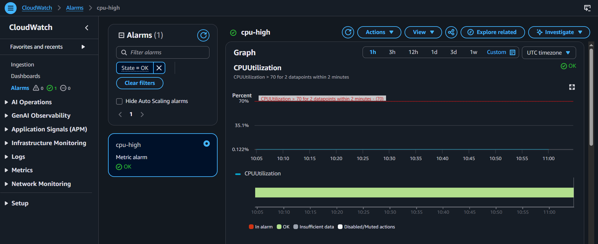
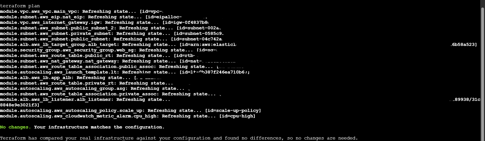

# Terraform AWS DevOps Infrastructure

Production-ready AWS infrastructure built using **Terraform modules**.  
This project demonstrates how to deploy a scalable and highly available infrastructure using AWS services.

---

# Architecture Diagram

The infrastructure follows a production-style architecture with load balancing and auto scaling.


---

# Project Overview

This Terraform project provisions a complete AWS infrastructure including:

- VPC
- Public Subnets
- Private Subnet
- Internet Gateway
- NAT Gateway
- Route Tables
- Security Groups
- Application Load Balancer
- Target Group
- Launch Template
- Auto Scaling Group
- CloudWatch Scaling Policy
- Terraform Remote Backend (S3 + DynamoDB)

---

# Architecture Flow

```
Internet
   │
Application Load Balancer
   │
Target Group
   │
Auto Scaling Group
   │
EC2 Instances
   │
Private Subnet
   │
NAT Gateway
   │
Public Subnet
   │
Internet Gateway
   │
VPC
```

---

# Project Structure

```
terraform-aws-devops-infrastructure
│
├── modules
│   ├── vpc
│   ├── subnet
│   ├── security-group
│   ├── alb
│   └── autoscaling
│
├── architecture
│   └── aws-architecture.png
│
├── screenshots
│   ├── vpc.png
│   ├── alb.png
│   ├── autoscaling.png
│   └── cloudwatch.png
│
├── main.tf
├── provider.tf
├── variables.tf
├── outputs.tf
└── .gitignore
```

---

# Prerequisites

Before deploying this infrastructure make sure you have:

- AWS Account
- Terraform installed
- AWS CLI installed
- Git installed

---

# Configure AWS CLI

Run:

```
aws configure
```

Enter:

```
AWS Access Key
AWS Secret Key
Region (us-east-1)
```

---

# Deployment Guide

Clone the repository

```
git clone https://github.com/manesauraabh1704-devops/terraform-aws-devops-infrastructure.git
```

Navigate to project

```
cd terraform-aws-devops-infrastructure
```

Initialize Terraform

```
terraform init
```

Check execution plan

```
terraform plan
```

Deploy infrastructure

```
terraform apply
```

Type:

```
yes
```

Terraform will create the complete infrastructure automatically.

---

# Verify Infrastructure

After deployment check the AWS console for:

- VPC
- Subnets
- EC2 instances
- Load balancer
- Auto scaling group
- CloudWatch alarms

---

# Terraform Remote Backend

Terraform state is stored remotely using:

S3 Bucket → Terraform state storage  
DynamoDB → State locking

Benefits:

- Prevents state corruption
- Supports team collaboration
- Secure infrastructure management

---

# Auto Scaling Configuration

Auto scaling is configured using CloudWatch metrics.

Scaling rule:

If **CPU Utilization > 70%**

Then **Auto Scaling Group launches new EC2 instance automatically**

---

# Project Screenshots

## VPC



## Application Load Balancer


## Auto Scaling Group



## CloudWatch Alarm




## Terraform Plan Output



---

# Destroy Infrastructure

To delete all resources run:

```
terraform destroy
```

Type:

```
yes
```

---

# Author

Saurabh  

DevOps Engineer  
AWS | Terraform | Docker | Kubernetes

---

# License

This project is open source and available under the MIT License.
